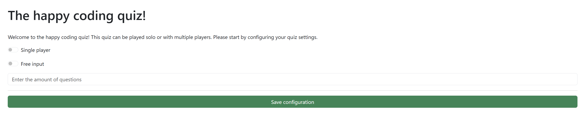
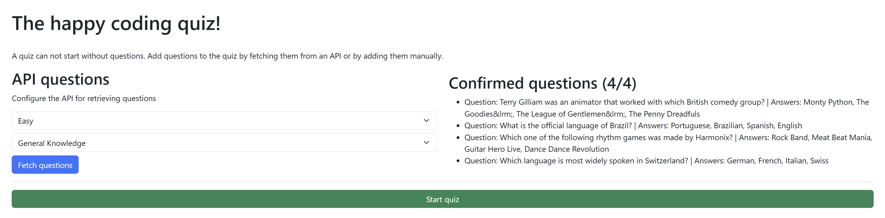
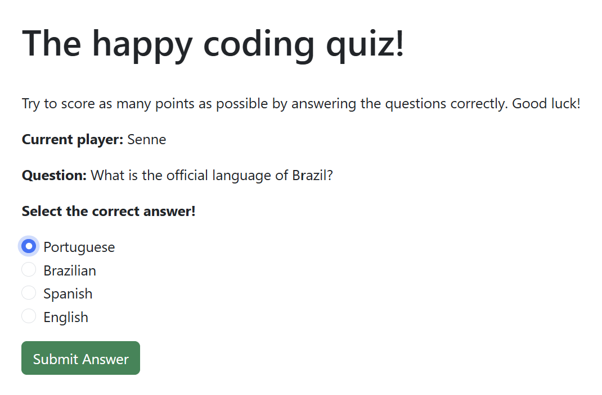
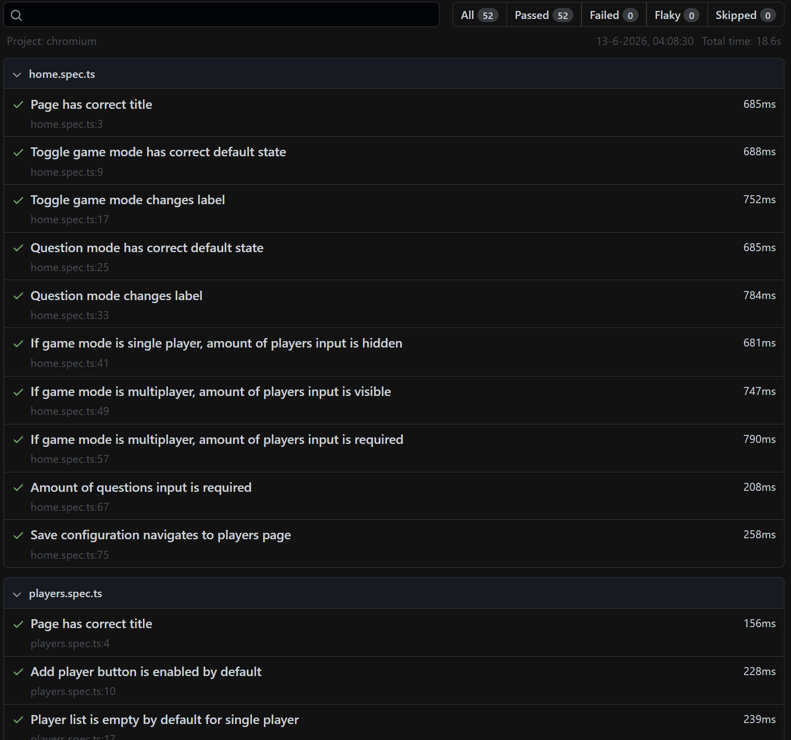

# Bewijsbeschrijving

Dit was een project wat wel wat tijd heeft gekost. Ook al was het een project waar je met 2 aan mocht werken, was het ook één van onze eerste keren dat we zo'n "groot" project moesten maken in TypeScript. Door deze opdracht heb ik veel bijgeleerd i.v.m. TypeScript.

De opdracht was om een bestaand bestand met allerlei functies en pagina's uit te breiden naar een volledig werkende quiz. Deze quiz kon zowel single- als multiplayer gespeeld worden.

Het startbestand had al verschillende playwright tests, de bedoeling was om de applicatie uit te breiden en deze te laten voldoen de tests.

## Voorbeelden

